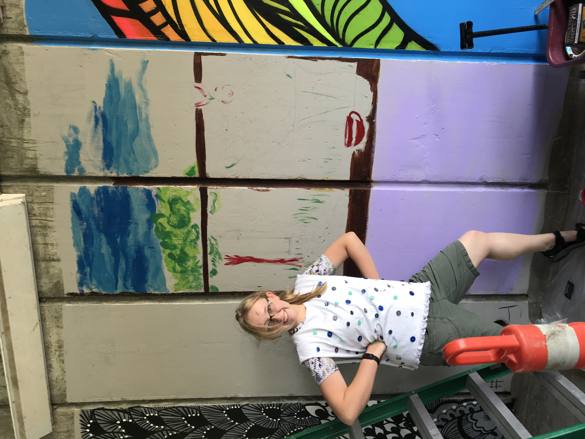

## Mural

I really enjoyed this project, though the downside of painting a mural is that you can see all of your mistakes, and now they're really big! But I like the parts of this mural that I worked hard on, like the reflections on the vase and the clouds. 

